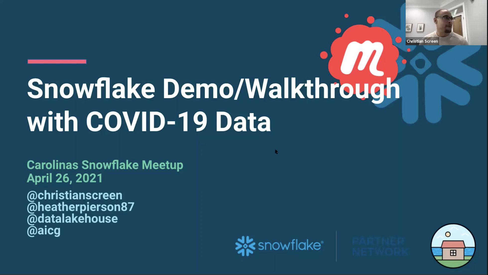

# Snowflake Demo/Walkthrough with COVID-19 Data
Monday, April 26, 2021

We had a great turnout for our last event. This time we're going to get more hands on with Snowflake. Join us to as we go through some basic use cases in Snowflake using COVID-19 data for general exploration through the Snowflake platform with data relevant to all of our current lives. RSVP in advance and be sure to bring your question. Don't forget to tell a friend or colleague.

## Video/Audio Recordings
https://youtu.be/nhgDBF8m8rw

## Other Information
See folder for additional items:
- [SQL Queries Used](SQL-Queries-Logic.sql)

## Attribution & Thanks
- David A Spezia @ Snowflake - SQL Queries
- Felipe Hoffa @ Snowflake - prompt to revisit topic idea
