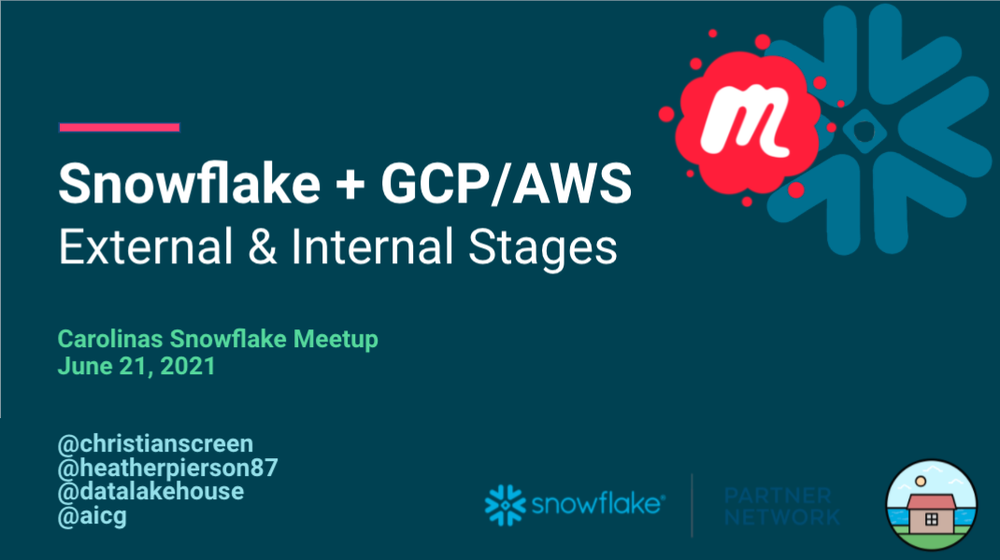

# Snowflake Stages on GCP/AWS (Internal / External)
Monday, June 21, 2021

This is the one where we talk about Snowflake Internal and External Stages.
We focused on the Snowflake tooling, interface, and setting up access to 
Google Cloud storage.

## Video/Audio Recordings
https://youtu.be/0oAkMo8Taow

## Other Information
See folder for additional items:
- [SQL Queries Used](SQL-Queries-Logic.sql)

## Attribution & Thanks
- https://twitter.com/Paul_at_SNOW
- https://twitter.com/christianscreen/status/1404128971919351812

