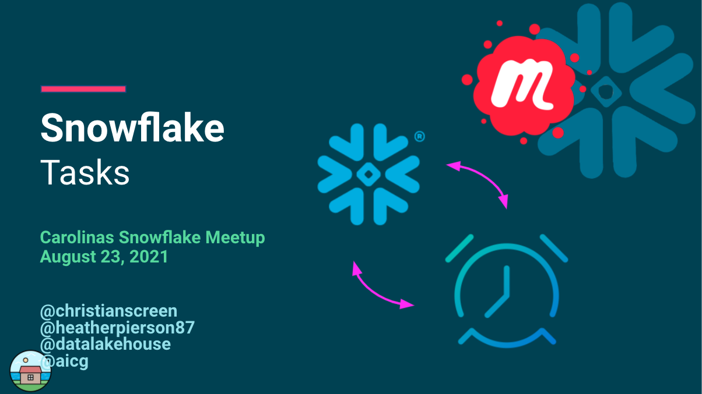

# Snowflake Stages on GCP/AWS 
Monday, August 23, 2021

This is the one where we talk about Snowflake Tasks.
We focused on the Snowflake interface and setting up access to Google Cloud storage.

## Video/Audio Recordings
https://www.youtube.com/channel/UCXn_h8XICmf3sH-7wSWhSRQ

## Other Information
See folder for additional items:
- [SQL Queries Used](SQL-Queries-Logic.sql)

## Attribution & Thanks
- 
- 

