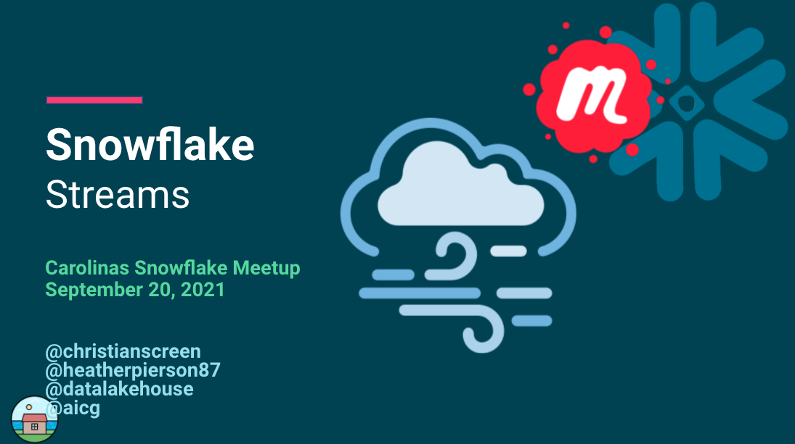

# Snowflake Streams 
Monday, September 20, 2021

This is the one where we talk about Snowflake Streams.
We focused on the Snowflake interface and walking through several scenarios with streams, tasks, and selecting from a stream.

## Video/Audio Recordings
https://www.youtube.com/channel/UCXn_h8XICmf3sH-7wSWhSRQ

## Other Information
See folder for additional items:
- [SQL Queries Used](SQL-Queries-Logic.sql)

## Attribution & Thanks
- All of our attendees, with all the great questions and interaction
- 

