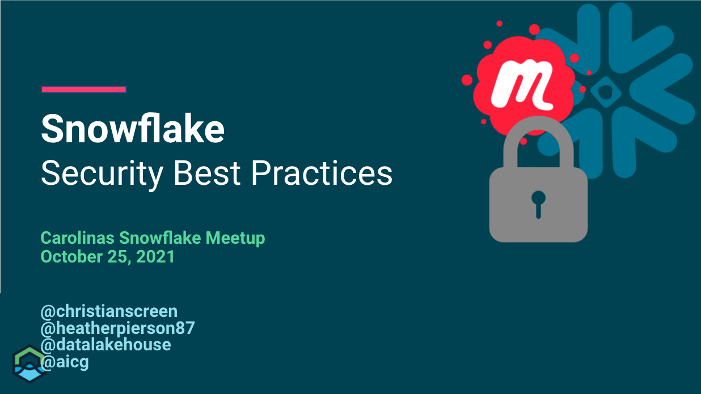

# Snowflake Security 
Monday, October 25, 2021

This is the one where we talk about Snowflake Secrurity.
We focused on the Snowflake interface and walking through several scenarios with Role Based Access Controls (RBAC), terminology, default roles, default warehouse, default namespace.

## Video/Audio Recordings
https://youtu.be/hizgoINdTC0

## Other Information
See folder for additional items:
- [SQL Queries Used](SQL-Queries-Logic.sql)

## Attribution & Thanks
- All of our attendees, with all the great questions and interaction
- 

